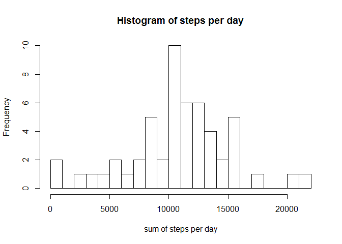
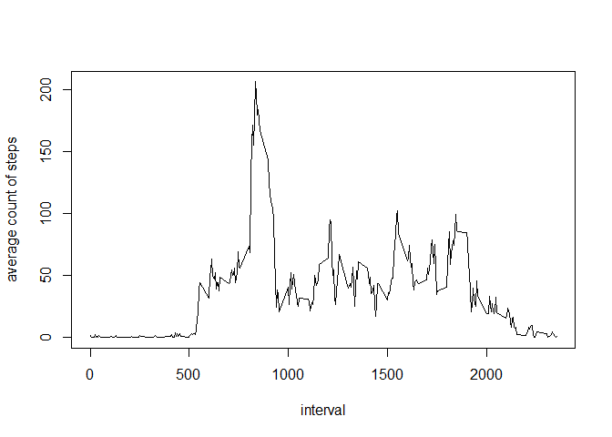
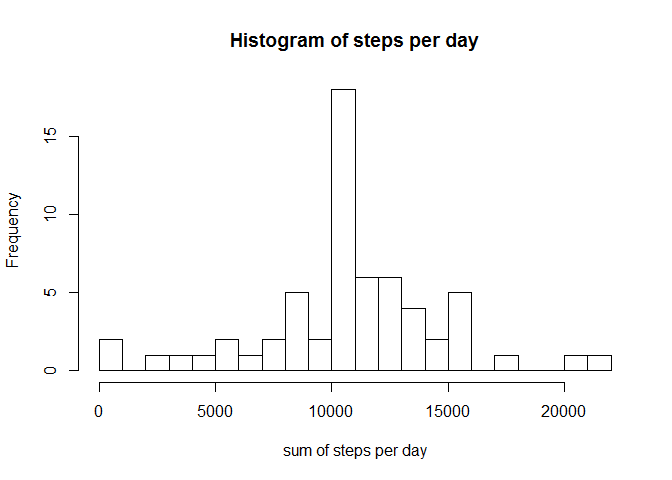
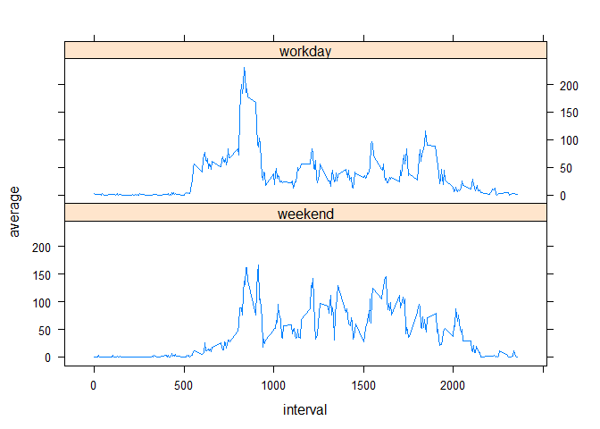

# Reproducible Research: Peer Assessment 1


## Loading and preprocessing the data


```r
df <-read.csv("activity.csv")
```


## What is mean total number of steps taken per day?

First we calaculate a dataframe, that contains in the first column the day, 
in the second column the sum of all steps over the day and the third column 
contains the average of steps of a 5-min interval.


```r
len<-length(unique(df$date))
stepsdf<-data.frame("day" = character(len), "sum" = numeric(len),"average" = numeric(len) ,stringsAsFactors=FALSE)

for (i in 1:len){

  stepsdf[i,1]<- as.character(unique(df$date)[i])
  stepsdf[i,2]<-sum(subset(df,date==unique(df$date)[i])$steps)
  stepsdf[i,3]<-mean(subset(df,date==unique(df$date)[i])$steps)
                
}
```
We now plot the histogram and the summary of the day-sums:

```r
hist(stepsdf$sum,breaks=20,main="Histogram of steps per day", xlab="sum of steps per day")
```

<!-- -->

```r
summary(stepsdf$sum)
```

```
##    Min. 1st Qu.  Median    Mean 3rd Qu.    Max.    NA's 
##      41    8841   10760   10770   13290   21190       8
```
##What is the average daily activity pattern?

For every time interval we calculate the average of steps over all days and store the results in 
the data_frame "stepns_int_df". We plot then the first col. (interval) against the second col. 
(average of steps of certain interval over all days.):


```r
len<-length(unique(df$interval))
steps_int_df<-data.frame("interval" = integer(len), "average" = numeric(len) ,stringsAsFactors=FALSE)

for (i in 1:len){

  steps_int_df[i,1]<- unique(df$interval)[i]
  steps_int_df[i,2]<-mean(subset(df,interval==unique(df$interval)[i])$steps,na.rm=TRUE)
                
}

plot(steps_int_df[,1], steps_int_df[,2],type="l", xlab="interval",ylab="average count of steps")
```

<!-- -->

###What is the 5-minute interval, on average across all the days in the dataset, contains the maximum number of steps?


```r
maximum<-max(steps_int_df[,2])
```
Maximum:

```r
print(steps_int_df[which(steps_int_df$average==maximum),])
```

```
##     interval  average
## 104      835 206.1698
```

##Imputing missing values

We first calculate the count of missing values for the step-variable:


```r
sum(is.na(df$steps))
```

```
## [1] 2304
```
We copy the original dataframe "df" to a datframe "df2", where the missing values are replaced by the
average of the interval, that we have stored in the "steps_int_df" dataframe:


```r
df2<-df

for(i in 1:nrow(df)){
  
  if(is.na(df[i,1])){
    vec<- steps_int_df$interval==df[i,3]
    repl<-steps_int_df[vec,2]
    df2[i,1]<-repl
    
  }
}
```

We generate an analogous datframe that contains the daily-sums and plot an histogram of theses sums and the 
summary.

```r
len<-length(unique(df2$date))
stepsdf2<-data.frame("day" = character(len), "sum" = numeric(len),"average" = numeric(len) ,stringsAsFactors=FALSE)

for (i in 1:len){

  stepsdf2[i,1]<- as.character(unique(df2$date)[i])
  stepsdf2[i,2]<-sum(subset(df2,date==unique(df2$date)[i])$steps)
  stepsdf2[i,3]<-mean(subset(df2,date==unique(df2$date)[i])$steps)
                
}
hist(stepsdf2$sum,breaks=20, main="Histogram of steps per day", xlab="sum of steps per day")
```

<!-- -->

```r
summary(stepsdf2$sum)
```

```
##    Min. 1st Qu.  Median    Mean 3rd Qu.    Max. 
##      41    9819   10770   10770   12810   21190
```

**So we see, that the mass of the distribution was shifted a bit to the left.**


## Are there differences in activity patterns between weekdays and weekends?

We generate a factor-variable "fac", that contains the information, wether it's a 
workday or it's a day of a weekend. We calculate for all intervals a "weekday" and 
a "workday"-average, and store the information as a row in the dataframe "int_av".
"

The final plot shows, that at the weekend the steps are more equally distributed over the day than on the workdays. 


```r
library(lattice)
vec<-weekdays(as.Date(df2$date))
fac<-factor(vec=="Sonntag"|vec=="Samstag", labels=c("workday","weekend"))
df2<-cbind(df2,fac)
names(df2)[4]<-"daykind"

intervals<-unique(df2$interval)

int_av<-data.frame( integer(0),character(0) ,numeric(0),stringsAsFactors=FALSE)
for(i in intervals){
 
  relevant_values_workday<-subset(df2,df2$interval==i&df2$daykind=="workday")$steps
  relevant_values_weekend<-subset(df2,df2$interval==i&df2$daykind=="weekend")$steps
  
  int_av<-
    rbind(int_av,list(i,"workday",mean(relevant_values_workday)),list(i,"weekend",mean(relevant_values_weekend)))
  
}

names(int_av)[1]<-"interval"
names(int_av)[2]<-"daykind"
names(int_av)[3]<-"average"

xyplot(average~interval|daykind,data=int_av,layout=c(1,2),type="l")
```

<!-- -->


